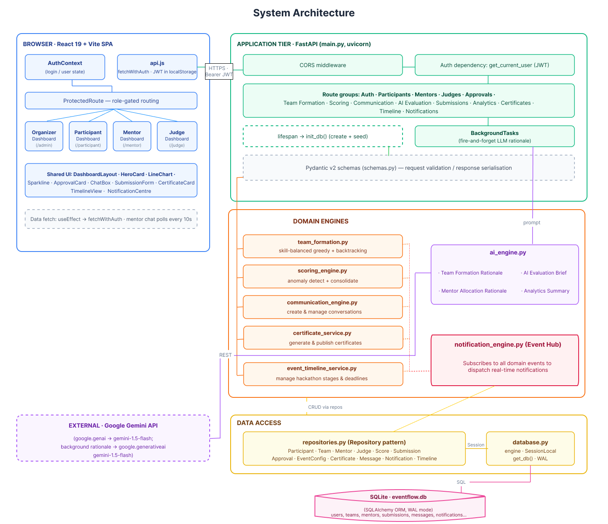
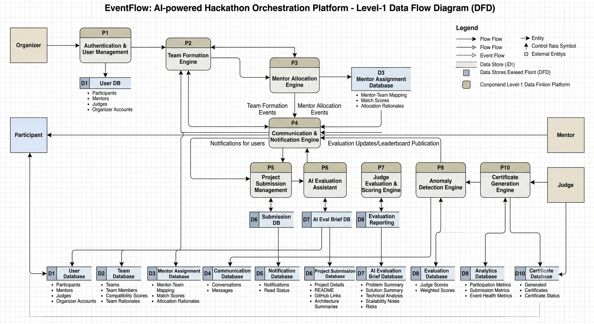

# EventFlow

**AI-Powered Hackathon Orchestration Platform**

Built for the TI WiSE Hackathon.

EventFlow is a single platform for running a hackathon end to end. Organizers, participants, mentors, and judges all work inside one system, so the whole event lifecycle (registration, team formation, mentoring, submissions, judging, results, and certificates) happens in one place instead of being spread across spreadsheets, chat groups, and form tools.

The guiding idea is simple: let the AI take care of the repetitive work, but keep a human in charge of every decision that actually matters.

## The problem

Organizing a hackathon involves a lot more than collecting registrations. Teams have to be formed fairly, mentors need to be matched to the right projects, participants must stay informed, judges need enough context to evaluate work properly, and organizers need a clear view of what is happening at every stage. In most events these jobs are handled through several disconnected tools and manual coordination, which gets slow, repetitive, and hard to manage as the event grows.

## What we set out to build

* **One unified platform** that brings participants, mentors, judges, and organizers together for the full event lifecycle.
* **Smart team formation** that builds balanced teams automatically from skills, experience, and institution constraints.
* **Mentor allocation** that assigns mentors to teams based on expertise and project needs.
* **AI-assisted evaluation** that helps judges understand submissions faster through generated project briefs.
* **Event communication** through notifications, in-app chat, and role-based dashboards.
* **Fair scoring and analytics** using weighted scoring, anomaly detection, and live event analytics.

## What makes EventFlow different

* **Unified end-to-end ecosystem.** Role-gated interfaces for Organizer, Participant, Mentor, and Judge, with shared workflows and persistent communication, replace a pile of separate third-party tools.
* **Algorithmic team and mentor matching.** A constraint-aware greedy plus backtracking algorithm forms skill-balanced teams, and an automated allocation step matches mentors to teams, so organizers no longer coordinate this by hand.
* **Non-blocking AI evaluation assistant.** The Gemini SDK runs through FastAPI background tasks to read submission data and produce structured briefs for judges without slowing the interface down.
* **Statistically rigorous scoring.** A panel-size-aware anomaly detection engine catches inconsistent or biased judge scores and holds the affected team until a human reviews it.
* **Reliable, decision-safe architecture.** Event-driven notifications, enum-based approval state machines, and explicit human-reviewed approval gates sit on top of a concurrent SQLite WAL database.

## System architecture

EventFlow uses an N-tier design. The browser holds the UI and routing, FastAPI handles requests and orchestration, the domain engines hold the real logic, and a repository layer owns all database access.



The three domain engines are pure Python with no web or database imports, so each one can be tested on its own. Route handlers never run queries directly. They go through repository classes, which keeps the handlers short and easy to follow.

## Data flow (Level-1 DFD)

The platform is organized as a set of processes that read from and write to dedicated data stores. External actors (Organizer, Participant, Mentor, Judge) interact only through these processes.



Team-formation and mentor-allocation events flow into the notification engine (P4), which pushes updates to users and publishes evaluation results and the leaderboard once an organizer approves them.

## How the three engines work

**team_formation.py** builds teams with a skill-balanced greedy method plus backtracking. It first checks whether valid teams are even possible under the institution rule, then scores each candidate by how many missing skills they add (weighted 0.7) and how well they balance experience levels (weighted 0.3). One participant per institution per team is a hard constraint. If the greedy pass gets stuck, it swaps members between teams to break the deadlock, and anyone who still cannot be placed goes into a clearly marked overflow team rather than being dropped. A fixed seed makes the result reproducible, which matters when an organizer has to defend why a team was formed a certain way.

**scoring_engine.py** consolidates judge scores and watches for outliers. The method adapts to how many judges scored a team: an absolute-gap rule for two judges, a leave-one-out comparison for three, and a z-score against the panel for four or more. Flagged scores are set aside and the team is held off the leaderboard until an organizer reviews it. The final score is a weighted average across five rubric dimensions (innovation, technical depth, presentation, feasibility, impact), with weights configurable per event.

**ai_engine.py** uses Gemini only for language work: turning messy registration bios into clean skill tags, writing team rationales, drafting mentor introduction emails, generating evaluation briefs for judges, and writing the final event summary. Every prompt is built from real database fields, so the model writes about facts the system already holds rather than inventing them.

## Tech stack

| Technology | Why we chose it |
|------------|-----------------|
| React + Vite | Fast build for a multi-role single-page app |
| Tailwind CSS | Quick, consistent styling across the dashboards |
| FastAPI | Clean Python APIs with built-in validation and async support |
| SQLite (WAL mode) | Simple file-based database, easy to ship, good concurrent reads |
| SQLAlchemy | Manages the data model and lets us move to Postgres later |
| JWT + bcrypt | Secure, role-based authentication |
| Google Gemini (gemini-2.5-flash, google-genai SDK) | Generates briefs, rationales, and summaries |

## Getting started

### Prerequisites
* Python 3.10 or newer
* Node.js 18 or newer
* A Google Gemini API key (https://aistudio.google.com/apikey)

### 1. Backend

```bash
cd backend
pip install -r requirements.txt

# add your API key
cp .env.example .env          # then open .env and paste your key
# or set it in the shell:
#   macOS/Linux:  export GEMINI_API_KEY="your_key"
#   Windows PS:   $env:GEMINI_API_KEY="your_key"

python seed.py                # loads demo data
uvicorn main:app --reload     # API on http://localhost:8000  (docs at /docs)
```

### 2. Frontend

```bash
cd frontend
npm install
npm run dev                   # app on http://localhost:5173
```

## Demo accounts

After running `python seed.py`, sign in with any of these (password for all: `password123`):

| Role | Username |
|------|----------|
| Organizer | `admin` |
| Participant | `aarav` |
| Mentor | `mentor_sarah` |
| Judge | `judge_michael` |

The seed creates 1 organizer, 20 participants, 5 mentors, and 3 judges.

## Project structure

```
backend/
  main.py            FastAPI app and all routes (thin handlers)
  repositories.py    Repository layer (all database queries live here)
  models.py          SQLAlchemy models, enums, approval state machine
  schemas.py         Pydantic request and response schemas
  database.py        Engine, session factory, init and seed helpers
  team_formation.py  Team-formation engine
  scoring_engine.py  Anomaly detection and score consolidation
  ai_engine.py       Gemini language tasks
  seed.py            Demo data loader
frontend/
  src/
    pages/           One dashboard per role (organizer, participant, mentor, judge)
    components/      Shared UI (cards, charts, layout, protected routes)
    context/         Auth context
    api.js           Single API client (attaches JWT, handles 401)
```

## What we learned

Bringing several modules into one workflow, securing role-based access, and keeping every feature database-driven were the main challenges. Along the way we worked on designing a scalable architecture, building secure APIs with FastAPI and JWT, fitting AI into a real product, modeling data with SQLAlchemy, and creating a fair evaluation system with scoring and anomaly detection.

## Future scope

* An ML model to predict team compatibility and improve formation.
* A recommendation model for mentor assignment based on skill gaps and project domain.
* Real-time chat over WebSockets for participants and mentors.
* GitHub integration for automatic project and commit analysis.
* Multi-event support for hackathons, case competitions, and coding contests.
* AI-based plagiarism and project-similarity detection.
* Cloud deployment and a move to PostgreSQL with PgBouncer for heavy concurrent traffic.
